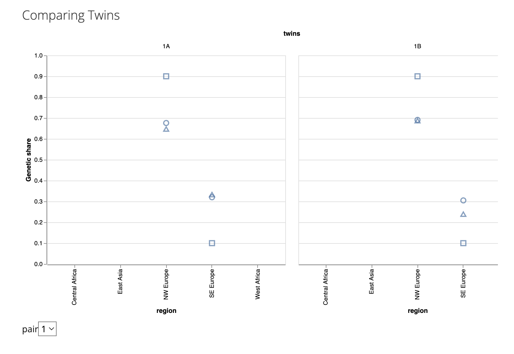
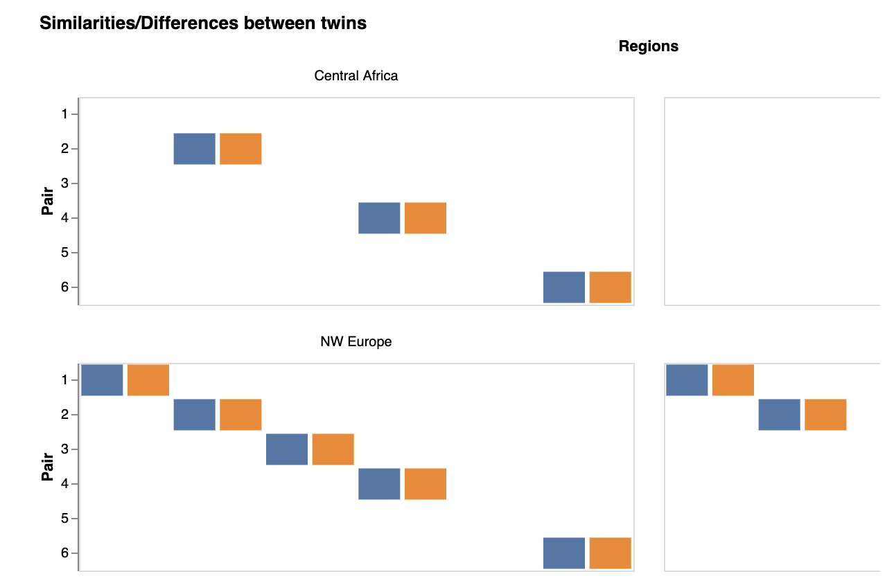
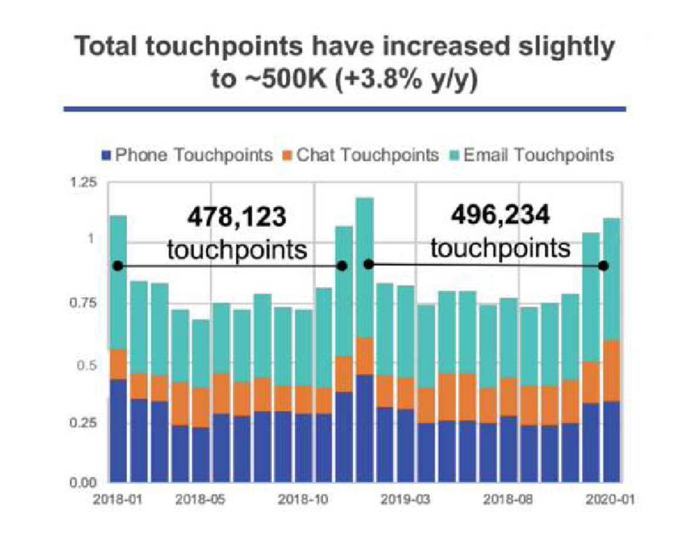

```{r}
#| include: false
library(vegawidget)
library(dplyr)
library(reticulate)
library(altair)
library(jsonlite)
library(htmltools)
library(tidyverse)
library(tidyr)
library(vegabrite)
library(lubridate)
```

# Exercise 1: DNA Kit Evaluation

```{r}
twins_wide <- fromJSON("https://calvin-data304.netlify.app/data/twins-genetics-wide.json")

twins_long <- fromJSON("https://calvin-data304.netlify.app/data/twins-genetics-long.json")
```

### a. An example from HW 4 gallery that I like



I like Priscilla Chen's graph that compares twins using shapes and a selector. This allows me to look at each twin pair compared to the other and see 1. Breakdown of kit results, and 2. Slight differences in genetic share. For example, kits associated with the circle and triangle seem to be slightly different, where the circle kit produces a higher genetic share for NW Europe than the triangle kit in twin 1A and twin 1B has the circle and triangle for NW Europe layered on top of each other. Then, I can see that since the position for twins for a specific test was different, we are able to see the differences between twins easily. 

### b. An example from HW 4 gallery that I don't like



I think that Sucry's Comparing Twins graph doesn't show enough that indicates that we are trying to compare twins for genetic share. 

I thought at first that the twin pair was showing the genetic percentage, but I think he was using pair as a quantitative scale on the y axis but it is actually a nominal variable, but it makes the graph seem a bit misleading as it seems like twins 2A and 2B have more of a genetic share in West Africa than twins 3A and 3B, even though that's not necessarily true. 

### 1c. Graph comparing twins

```{r}
vl_chart() |>
  vl_add_data(twins_long) |>
  vl_mark_circle(size = 75) |>
  vl_encode_x(field = "genetic share", type = "quantitative", title = "Genetic Share %") |>
  vl_encode_y(field = "region", type = "nominal", title = "Region") |>
  vl_add_parameter("type_param", value = "1") |>
  vl_bind_select_input(parameter_name = "type_param", name = "Twin Pair ", options = list(1, 2, 3, 4, 5, 6)) |>
  vl_filter("datum.pair == type_param") |>
  vl_encode_color(field = "id", type = "nominal", title = "ID Of Twin") |>
  vl_encode_column(field = "kit", type = "nominal", title = "") |>
  vl_add_properties(width = 150, height = 150, title = list(text = "Twin Comparison of Genetic Shares By Region", subtitle = "Genetic Share % is on a scale from 0-1, where 0.1 = 10%, 0.2 = 20%, etc")) |>
  vl_add_interval_selection(
    name = "panzoom", 
    # bind the interval selection to x and y the scales 
    bind = "scales",  encodings = c("x", "y"),
    translate = TRUE,     # enable panning (default)
    zoom = TRUE)
```

This graph helps compare twins by allowing the audience to select a specific twin pair and seeing the genetic share of the twins, with color distinguishing between whether they were twin "A" or twin "B". This allows a clear difference to be seen if a blue or orange dot are far apart or close together. For example, for Twin Pair A, the genetic share of SE Europe for MyHeritage is not the same, showing that twins have differences in MyHeritage kits, but the Ancestry kit shows that the twins are the same as the points overlap. Since an audience can perceive color and position quickly, it is easy to see when a set of twins deviate from each other. 

### 2c. Graph comparing kits

```{r}
vl_chart() |>
  vl_add_data(twins_long) |>
  vl_mark_circle(size = 150) |>
  vl_encode_x(field = "genetic share", type = "quantitative", title = "Genetic Share %") |>
  vl_encode_y(field = "region", type = "nominal", title = "Region") |>
  vl_add_parameter("type_param", value = "1A") |>
  vl_bind_select_input(parameter_name = "type_param", name = "Twin ID ", options = list("1A", "1B", "2A", "2B", "3A", "3B", "4A", "4B", "5A", "5B", "6A", "6B")) |>
  vl_filter("datum.twin == type_param") |>
  vl_encode_color(field = "kit", type = "nominal", title = "Genetic Kit") |>
  vl_add_properties(width = 300, height = 150, title = list(text = "Kit Comparison of Genetic Shares By Region", subtitle = "Genetic Share % is on a scale from 0-1, where 0.1 = 10%, 0.2 = 20%, etc")) |>
    vl_add_interval_selection(
    name = "panzoom", 
    # bind the interval selection to x and y the scales 
    bind = "scales",  encodings = c("x", "y"),
    translate = TRUE,     # enable panning (default)
    zoom = TRUE)
```

The graph comparing the kits was created so that we can select a specific twin and see how different each of the kits evaluated the specific twin's genetic makeup. With region on the y axis and genetic share percentage on the x axis, we can evaluate the spread of the genetic kit breakdown. For example, the default is twin 1A, which shows that for the genetic kit "Ancestry", the kit shows that twin 1A is 90% NW European and 10% SE European. This contrasts to the results of 23andMe. In the 23andMe kit, it shows a ~68% share for NW Europe and a 32% makeup for SE Europe. The difference for NW Europe for Ancestry and 23andMe is 22% (and same for SE Europe), which, in my opinion, is a pretty extreme difference. I wouldn't want there to be a possible 22% gap in my genetic makeup calculations. 

# Exercise 2: Data and Graphics Challenges 
```{r}
customer_touchpoints <- read.csv("https://calvin-data304.netlify.app/data/swd-lets-practice-ex-5-03.csv")
```


There are a few issues with the provided graphic. 
I don't like that it's a stacked bar chart. Knaflic says that stacked bar charts shouldn't really be used unless the sum means something, but if we already add them all up at the end of each year, then it probably makes it harder to evaluate whether or not we had more email or phone touchpoints. Another issue is the y axis. There is no title, so even though it seems like the axis is in hundreds of thousands, it just looks like a 0-1.25 scale, which is not helpful because it doesn't make sense without a descriptive title. If it's tryign to show tens of thousands of touchpoints, the issue is that the sum is also wrong. I calculated the approximate amount and it is not 478,000 touchpoints for 2018. It's more closely ~970,000 for all of 2018. 

I think that maybe a slope graph may work well. It seems like the author of the graphic wants to compare overall 2018 and 2019. 

```{r}
customer_touchpoints <- customer_touchpoints |>
  mutate(datetime = ym(Date), year = year(datetime))
```

```{r}
customer_touchpoints_long <- customer_touchpoints |> pivot_longer(cols = ends_with("Touchpoints"), names_to = "Channel",names_pattern = "(.*)\\.Touchpoints", values_to = "Touchpoints")
```

```{r}
# Group 2019 and the start of 2020
customer_touchpoints_grouped <- customer_touchpoints_long |>
  mutate(year_group = ifelse(year %in% c(2019, 2020), "2019-2020", as.character(year))) |>
  group_by(year_group, Channel) |>
  summarise(Touchpoints = sum(Touchpoints), .groups = "drop") |>
  arrange(Channel, year_group)
```

I grouped 2019 and 2020 together because it calculates to the first month of 2020. 

```{r}
customer_lines <- vl_chart() |> 
  vl_add_data(customer_touchpoints_grouped) |>
  vl_mark_line(size = 3) |>
  vl_encode_x('year_group:O', title = "Year") |>
  vl_axis_x(labelAngle = 0) |>
  vl_scale_x(padding = 0.5) |>
  vl_encode_y('Touchpoints:Q', title = "Number of Touchpoints (Tens of Thousands)") |>
  vl_encode_color('Channel:N', title = "Touchpoint Type") |>
  vl_add_properties(width = 400, height = 300)

customer_text <- vl_chart() |> 
  vl_add_data(customer_touchpoints_grouped) |>
  vl_encode_x('year_group:O', title = "") |>
  vl_scale_x(padding = 0.5) |>
  vl_encode_y('Touchpoints:Q', title = "") |>
  vl_encode_text('Touchpoints:Q') |>
  vl_encode_color(value = "black") |>
  vl_mark_text(align = "center", baseline = "bottom", fontSize = 12) |>
  vl_add_properties(width = 400, height = 300) 

vl_layer(customer_lines, customer_text) |>
  vl_add_data(customer_touchpoints_grouped) |>
  vl_add_properties(title = "YTD Customer Touchpoints Have Increased +3.8% y/y")
```

In the original graph, it seems as though the story is attempting to show change over time but still showing the number of touchpoints. This allows us to see the largest changes from 2018 to 2019/2020, where all customer touchpoints have increased but chat and email touchpoints increased at a higher rate than phone touchpoints. 

# Exercise 3: Demographic and Health Surveys For Tanzania

```{r}
tanzania_health <- read.csv("~/DATA304/DATA304-Portfolio/docs/hw/data/tanzania.csv")
```

### a. Dealing with Year Span Issues

I am not sure the best practice for this messy data situation, but I asked the data architect that I currently intern under and he said that he would personally split up the year spans but keep the same data. In this situation, there would be one row for 2015 and one row for 2016, but they have the same values. 

### b. Visualization

```{r}
# function to split up the data
expand_years <- function(year) {
  if (grepl("-", year)) {
    years <- as.numeric(unlist(strsplit(year, "-")))
    return(seq(years[1], years[2]))
  } else{
    return(as.numeric(year))
  }
}
```

```{r}
tanzania_health_expansion <- tanzania_health |>
  rowwise() |>
  mutate(DHS.Survey.Year = list(expand_years(DHS.Survey.Year))) |>
  unnest(DHS.Survey.Year) |>
  ungroup()
```

```{r}
contraception_line <- vl_chart() |>
  vl_mark_line(color = "blue", size = 3) |>
  vl_encode_y(field = "Use.of.Contraception:Q")

contraception_point <- vl_chart() |>
  vl_mark_circle(tooltip = TRUE, color = "blue") |>
  vl_encode_y(field = "Use.of.Contraception:Q")

contraception <- vl_layer(contraception_line, contraception_point)

family_plan_line <- vl_chart() |>
  vl_mark_line(color = "orange", size = 3) |>
  vl_encode_y(field = "Unmet.Family.Planning.Need:Q")

family_plan_point <- vl_chart() |>
  vl_mark_circle(tooltip = TRUE, color = "orange") |>
  vl_encode_y(field = "Unmet.Family.Planning.Need:Q")
  
family_plan <- vl_layer(family_plan_point, family_plan_line)

family_contraception <- vl_layer(contraception, family_plan) |>
  vl_encode_x(field = "DHS.Survey.Year:O",title = "Survey Year") |>
  vl_axis_x(labelAngle = 0) |>
  vl_encode_y(type = "quantitative", title = "Percentage %") |>
  vl_add_data(tanzania_health_expansion) |>
  vl_add_properties(width = 275, height = 200, title = list(text = "Tanzania Health Indicators", subtitle = "Orange is 'Unmet Family Planning Need', blue line is 'Use of Contraception'"))
```


```{r}
fertility_line <-
  vl_chart() |>
  vl_add_data(tanzania_health_expansion) |>
  vl_mark_line(color = "green", size = 3) |>
  vl_encode_x(field = "DHS.Survey.Year:O", title = "Survey Year") |>
  vl_axis_x(labelAngle = 0) |>
  vl_encode_y(field = "Total.Fertility.Rate:Q", title = "Percentage %") |> 
  vl_add_properties(width = 275, height = 200, title = "Tanzania Fertility Rate")

fertility_point <-
  vl_chart() |>
  vl_add_data(tanzania_health_expansion) |>
  vl_mark_circle(tooltip = TRUE, color = "green") |>
  vl_encode_x(field = "DHS.Survey.Year:O") |>
  vl_encode_y(field = "Total.Fertility.Rate:Q")

fertility <- vl_layer(fertility_line, fertility_point)
```


```{r}
vl_hconcat(family_contraception, fertility) |>
  vl_add_data(tanzania_health_expansion)
```

### c. Story

Due to the difference in percentages for each of the health indicators, I made two different line graphs. Tanzania's fertility rate is much smaller than their use of contraception and may seem harder to read and interpret. 

The year on the x axis is a bit misleading. Unfortunately, because we are missing some data for multiple years, the x axis is not ordered correctly. There should be a larger gap between 1992 and 1996, but it currently has the same gap between 1991 and 1992. I attempted to add in data to show all years and just show nulls, but it made even less sense and only showed a couple of horizontal lines.

The story of the graphic is that unmet family planning need and fertility have been decreasing, where the use of contraception is rising. The use of contraception is an activity that directly stops pregnancy, so it makes sense that as contraception use increases, fertility decreases. The unmet family planning need also probably decreases as use of contraception rises because unmet family planning need means that the demand of people who need help planning families is increasing. With contraception/birth control, having no children means that there is no need for family planning. 

The overall takeaway is that from the 1990s to 2016, contraception use rose, while unmet family planning needs and fertility rates went down. 

# Exercise 4: My Masterpiece

I have a dataset for world food production for specific types of food. 

### a. Graphical Masterpiece 
```{r}
world_food <- read.csv("~/DATA304/DATA304-Portfolio/docs/hw/data/world_food.csv")
```

```{r}
world_food <- world_food %>%
  mutate(fao = grepl("FAO", Entity))
```

```{r}
colnames(world_food) <- gsub("\\..*\\.$", "", colnames(world_food))
```

```{r}
world_food_long <- world_food %>%
  pivot_longer(
    cols = starts_with("Maize") | starts_with("Rice") | starts_with("Yams") |
      starts_with("Wheat") | starts_with("Tomatoes") | starts_with("Tea") |
      starts_with("Sweet") | starts_with("Sunflower") | starts_with("Sugar") |
      starts_with("Soybeans") | starts_with("Rye") | starts_with("Potatoes") |
      starts_with("Oranges") | starts_with("Peas") | starts_with("Palm") |
      starts_with("Grapes") | starts_with("Coffee") | starts_with("Cocoa") |
      starts_with("Meat") | starts_with("Bananas") | starts_with("Avocados") |
      starts_with("Apples"),  # Include all production columns
    names_to = "food_prod_type",  # Name of the new column for food types
    values_to = "Value"  # Name of the new column for production values
  )
```

```{r}
filtered_world_food_long <- world_food_long |> filter(Entity %in% c("Oceania (FAO)", "Asia (FAO)", "Europe (FAO)", "Africa (FAO)", "Americas (FAO)") & Year > 2000)
```

```{r}
vl_chart() |>
  vl_add_data(filtered_world_food_long) |>
  vl_mark_rect(tooltip = TRUE) |>
  vl_encode_x(field = "Year", type = "ordinal", title = "Year") |>
  vl_axis_x(labelAngle = 0) |>
  vl_encode_y(field = "Entity", type = "nominal", title = "Region") |>
  vl_add_parameter("food_param", value = "Maize") |>
  vl_bind_select_input(parameter_name = "food_param", name = "Food Type ", options = list("Maize","Rice","Yams","Wheat","Tomatoes","Tea", "Sweet","Sunflower","Sugar", "Soybeans", "Rye", "Potatoes","Oranges","Peas","Palm","Grapes","Coffee","Cocoa","Meat","Bananas","Avocados","Apples")) |>
  vl_filter("datum.food_prod_type == food_param") |>
  vl_encode_color(field = "Value", type = "quantitative", title = "Metric Tonnes", scale = list(scheme = "inferno")) |>
  vl_add_properties(width = 600, height = 200, title = "Food Production")
```

I liked this heat map, but I also don't think it can showcase all of my abilities. 

I have gdp data for all countries from 2000 - 2021. 
```{r}
gdp <- read.csv("~/DATA304/DATA304-Portfolio/docs/hw/data/gdp.csv")
```

```{r}
gdp_long <- gdp |> pivot_longer(cols = starts_with("x"), names_to = "year", values_to = "GDP")
gdp_long$year <- sub("^X", "", gdp_long$year)
```

```{r}
filtered_gdp_long <- gdp_long |> filter(Country.Name %in% c("United States", "China", "Iraq", "Brazil", "Australia", "Germany", "Nigeria", "Nepal", "India", "Sweden", "Thailand", "Turkey", "South Africa"))
```


I am going to combine these so that I can see what food production looks like with richer countries. I have taken some economics classes and usually lower level production like textiles, food, and materials manufacturing are sent to poorer countries because the large scale of production can be achieved for a cheaper price than manufacturing in a place like the United States (i.e. the USA has a lot of tech entrepreneurs but minimal production facilities. We usually ship those jobs to Malaysia or another small, Asian country)


```{r}
filtered_world_food_gdp <- world_food_long |> filter(Entity %in% c("United States", "China", "Iraq", "Brazil", "Australia", "Germany", "Nigeria", "Nepal", "India", "Sweden", "Thailand", "Turkey", "South Africa"))
```

```{r}
filtered_gdp_long <- filtered_gdp_long |>
  mutate(Year = as.numeric(year))
```

```{r}
world_food_gdp <- filtered_world_food_gdp |> left_join(filtered_gdp_long, by = c("Entity" = "Country.Name", "Year" = "Year"))
```

```{r}
vl_chart() |>
  vl_add_data(world_food_gdp) |>
  vl_mark_circle(tooltip = TRUE, size = 100) |>
  vl_encode_x("GDP:Q", title = "GDP in US $") |>
  vl_axis_x(labelAngle = 0) |>
  vl_encode_y("Value:Q", title = "Metric Tonnes of Production") |>
  vl_add_parameter("country_param", value = "United States") |>
  vl_bind_select_input(parameter_name = "country_param", name = "Country ", options = list("United States", "China", "Iraq", "Brazil", "Australia", "Germany", "Nigeria", "Nepal", "India", "Sweden", "Thailand", "Turkey", "South Africa")) |>
  vl_add_parameter("food_param", value = "Maize") |>
  vl_bind_select_input(parameter_name = "food_param", name = "Food Type ", options = list("Maize","Rice","Yams","Wheat","Tomatoes","Tea", "Sweet","Sunflower","Sugar", "Soybeans", "Rye", "Potatoes","Oranges","Peas","Palm","Grapes","Coffee","Cocoa","Meat","Bananas","Avocados","Apples")) |>
  vl_filter("datum.Entity == country_param & datum.year > 2000 & datum.food_prod_type == food_param") |>
  vl_add_properties(width = 400, height = 400, title = "GDP vs. Metric Tons of Food Type")
```

### b. Design Choices

For the Heat Map Chart: 
I made a heat map using the inferno color scheme to highlight the clear differences for each food type. For example, the Maize food type shows that the Americas was the largest producer. The yellows have a really large contrast to the dark blues and blacks. Wilke says that we should be intentional with our color and in class, we talked about how we should make sure it's still readable even for those who aren't able to interpret color. With this color scheme, we are able to tell brightness differences. Another choice I made was to add a tooltip, so if you hover over a specific square, you can see the number of metric tonnes the region produces. This allows us to see trends with color, but if we want to see a specific amount, it is possible. The final wrangling I did was that I filter into the regions rather than individual countries. There were so many countries that it didn't seem helpful and just seemed cluttering. I think that we can still get some points across with just using the regions. 

For the Food Production/GDP Chart: 
I created the metric tons vs. GDP chart to see if there was any correlation between a specific food type and the amount of money a country makes. The chart's parameters allows the user to choose a country and a food type. I did this because some foods aren't native to the land. I know that corn/maize is native to the US, so we probably make more maize than palm. I also added a tooltip so that we can see the true GDP and metric tonnes numbers. I also increased the size of the circles so that we can more easily see where the points lie since the scales are so large for the x and y coordinates. 

# Exercise 5: Using The Palette

### a. An encoding channel other than x or y

In almost every graph, I use color. Specifically, in the first twins graph, I included a color channel to differentiate between twin A and twin B. 

### b. Layers

In my customer touchpoints graph (Exercise 2), I used layers to layer the slope lines and the text layer (the layer that shows the number of touchpoints at the beginning and the end of the years) 

### c. Facets

I facet by kit in Exercise 1 where we find differences in twins. The facet shows the difference between twins for their genetic share of graphical regions for each of the different kits. The facet looks a lot better than encoding the kits using shape. 
### d. Concatenation or Repeat

I use concatenation in the Tanzania healthcare dataset to compare different rates for contraception use, unmet family planning need, and fertility rates. 

### e. Nondefault Settings For Scale or Guide

In every graph, I change the vl_add_properties to change the default size of the graph. Another change to the default scales/guides is in my Food Production heat map. I change the default color scheme to "inferno" because that is my favorite color scheme rather than the blues and greens that the default color scheme is. 

### f. Tooltips

Since I use a line chart for the Tanzania chart, I add another circle layer for each line that also has a tooltip so we can see the percentages for each year. 

### g. Another Interaction 

I allow the user to zoom in or out on the twins datasets. One issue is that I want to show the dots on the dotplots large enough to see position, but it also means that it can be hard to calculate differences easily. The zooming in can let us see whether or not they're the same or have a difference of 2-5%. 

# Exercise 6: Continuous Learning

### a. Not learned in class

In the customer touchpoints graph, I wanted to show the number of touchpoints along with a rate of change, but in class, we hadn't really done a chart that has a text layer on top of it, so it was a little difficult because I didn't know how to label the text correctly. At the default, it overlayed on the lines so I had to experiment with offsets. 

I am unsure if this was "new" since I knew it was possible but we hadn't really done it before, but in the Tanzania graphs, I used approximately 5 layers. In order to "debug" as I created the layers in vegaBrite, I ended up combining layers into smaller chunks and then taking the chunks and layering those. Even though the first set of layers aren't actually necessary, it did help the general organization and debugging process. 

Not related to the pure graphics, but a lot of this final portfolio is a large amount of data wrangling that I had to learn. I know a lot of wrangling principles but only in Python, so learning in R was a challenge. Some of the biggest issues I ran into was cleaning up data column names. For example, I got world data from the World Bank, so for some reason, the year names started with x and wouldn't register as an integer. I had to use some regex to fix that (yay Discrete Math 2!)

### b. Principles of Good Graphics

When I first started this exam, I was really worried because I couldn't think of a "good" graphic for twins or kits since the only ideas I had were my original "bad" charts from a few weeks ago. I think that one of the best pieces of advice that I got this semester is if I have data but don't know how to model it, to draw as many graphs as possible. This is from Knaflic's solution 2.3 on page 69 of "Storytelling with Data." I spent a lot of time drawing a bunch of types of graphs, even if they were bad or ones I knew I didn't want to make, but it led me to have better ideas later and allowed me to come up with a more intuitive graph. I also followed some of Knaflic's advice on page 95 where he suggests pulling in a friend or colleague to see if it's intuitive to them. I showed my parents and brother the touchpoints graph and they thought it condensed the data without losing the main message. They thought the original first graph (the bad one we had to fix) was too confusing and didn't like the stacked bars, but my graph was simple and easy to read. 

One piece of advice I took from Wilke was from section 19.1, where he talks about taking out color when color produces unnecessary or confusing information. In my "masterpiece" of the GDP vs. food production, I originally didn't have a food production dropdown selector, and originally put all of the data points onto the graph and coloring by production type. The only issue with this was that there were 20 something food production options, and adding 20 categorical variables made it hard to see overall trends, so I opted to allow the user to choose the country and the food type. 


